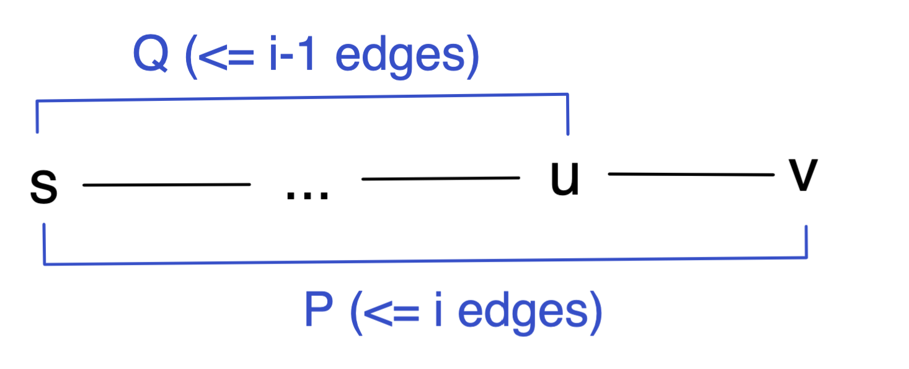

# Bellman-Ford算法证明

# 算法回顾

Bellman-Ford是寻找加权无向图（weighted undirected graph）中两个顶点之间最短路径的算法。用$G$表示图，$V$和$E$分别表示图中所有顶点和边的集合，记作$G=(V,E)$，用$s$表示起点。那么Bellman-Ford算法的伪代码形式如下：

```
bellman_ford(V, E, s)
	// v.d表示从s到v的最短路径长度，初始化为Infinity
	// v.p表示最短路径上该顶点的前一个顶点，即该顶点对应的parent（p）节点
	for v in V:
	    v.d = Infinity
	    v.p = None

	s.d = 0

	// |V|表示所有顶点的数量
	for i from 1 to |V| - 1:
			// u和v对应一条有向边的起点和终点
	    for (u, v) in E:
	        relax(u, v)

	// 执行完relax操作后，可以通过v.p回溯找到包含最短路径的所有边
```

其中用到的relax方法的伪代码定义如下：

```
relax(u, v):
	// w(u,v)表示顶点u和v之间边的权值
	if v.d > u.d + w(u,v):
	  v.d = u.d + w(u,v)
    v.p = u
```

简单来说，Bellman-Ford算法就是对图中的所有边进行$|V|-1$次`relax`操作，从而得顶点之间的最短路。该算法的好处在于，在执行完算法后，我们得到的不仅仅是$s$到某一个顶点之间的最短路径，而是$s$到所有其它顶点之间的最短路径。值得注意的是，在遍历所有边进行`relax`操作时，可以是任意遍历顺序。

# 算法证明

## 证明

这里我们假设图中没有negative cycle，主要关注怎么用数学归纳法（mathematical induction）来进行证明。

我们用$d_k(v)$表示$s$到$v$之间边数不超过$k$的最短路径长度，用$\delta(s, v)$表示$s$和$v$之间所有路径中最短的那一条的长度。因为$s$到任意顶点的简单路径（simple path）最多包含$|V|-1$条边，我们只需要证明$d_{|V|-1}(v)=\delta(s,v)$，便可完成对Bellman-Ford算法的证明。

首先证明**base case**。当循环$0$次时，即进入`relax`操作的循环前，$d_0(s)$为$0$，即起点$s$到它自己的最短路径为$0$。而对于其它顶点，$d_0(v)$为无穷大，即不存在一条$s$和$v$之间且边数为$0$的最短路径。显然这是正确的。

然后**假设**循环$i-1$次进行`relax`操作后满足$d_{i-1}(v)=\delta(s,v)$，即循环$i-1$次后，若$d_{i-1}(v)$不为无穷大，表示能够在$s$和$v$之间找到不超过$i-1$条边的最短路径。

最后我们来分析循环$i$次后，$d_i(v)$的取值。将$s$和$v$之间不超过$i$条边的最短路径记为$P$，用$w$来表示一条路径的长度或者两个顶点间边的权值，且$u$为$P$上处在$v$之前的一个顶点，那么$s$和$u$之间的路径$Q$最多包含$i-1$条边。



$Q$必然是$s$和$u$之间的最短路径，否则假若有更短的路径$Q\prime$，那么$w(P)=w(Q)+w(u,v)\geq w(Q\prime)+w(u,v)$，这与$P$为最短路径的定义相悖。

通过前面的假设，我们知道$w(Q)=d_{i-1}(u)$。根据算法，在第$i$次循环中$d_i(v)=\min(d_{i-1}(v), d_{i-1}(u)+w(u, v))$，即$d_i(v)=\min(d_{i-1}(v), w(P))$。而$d_{i-1}(v)$表示$s$和$v$之间边数不超过$i-1$的最短路径，其长度至少也是和$P$一样长，即$d_{i-1} \geq w(P)$，所以$d_i(v)=w(P)=\delta(s, v)$。不难看出，`relax`操作具有单调递减的性质，即$d_{i-1}(v)\geq d_{i}(v)$。

所以当算法循环$|V|-1$次后，$d_{|V|-1}(v)=\delta(s,v)$，命题得证。

# 参考

- [https://brilliant.org/wiki/bellman-ford-algorithm/](https://brilliant.org/wiki/bellman-ford-algorithm/)
- [https://www.youtube.com/watch?v=Ttezuzs39nk](https://www.youtube.com/watch?v=Ttezuzs39nk)
- [https://web.stanford.edu/class/archive/cs/cs161/cs161.1168/lecture14.pdf](https://web.stanford.edu/class/archive/cs/cs161/cs161.1168/lecture14.pdf)